# Créatures (PNJ)

Planches de créatures disponibles pour raycaster-386. Chaque vignette montre la
pose de repos sous 4 angles : **face, trois quarts, profil, dos**.

Toutes les planches ont les animations `idle`, `walk`, `attack`, `pain` et
`death` (la mort est rendue sous une seule direction, de trois quarts). Le
détail image par image (première tuile, durée, poses) est dans
`sprites/CATALOG.md`. Pour les rendre : voir [render.md](render.md).

Les vignettes viennent de `tools/thumbnails.py` : après une modification,
re-rendre la planche (`tools/sprites.py sprites/<nom>.json`) puis relancer
`tools/thumbnails.py <nom>`.

| Planche | Fichiers | Cadre |
|---|---|---|
| `sprites/<nom>.json` | scène `c_*.pov`, poses `inc/frames/*.inc` | 64×96, ou 96×96 pour les grands monstres |

## Morts-vivants

### zombie
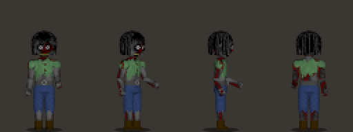

Zombie en chemise déchirée, pantalon bleuté, cheveux noirs. Attaque à mains nues.
Scène `c_zombie_1.pov`, poses `inc/frames/zombie.inc` (le modèle du format des poses).

### ghoul
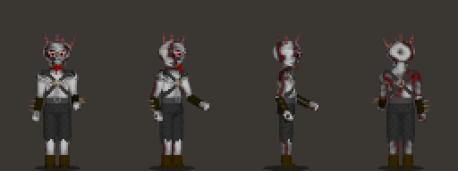

Goule : ancien crâne peint (`inc/skeleton/Skull_old.inc`) avec langue, casque à
cornes du chaos, harnais, brassards à pointes. Mêmes poses que le zombie.
Scène `c_ghoul_1.pov`, poses `inc/frames/zombie.inc`.

### skeleton
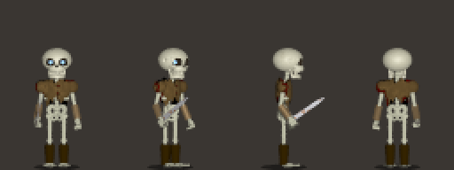

Squelette à l'épée (`inc/weapons/Weapon_Sword.inc`), chemise brune déchirée, crâne
modélisé (orbites lumineuses, mâchoire). Scène `c_skeleton_1.pov`, poses `inc/frames/skeleton.inc`.

### skeleton_archer
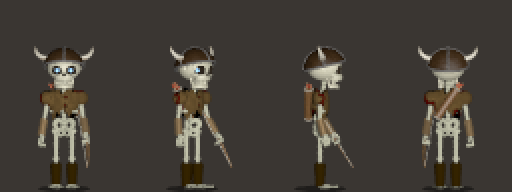

Squelette archer : arc, carquois dans le dos (`inc/weapons/Quiver.inc`), casque à
cornes. Tir en 4 images (visée, demi-tension, pleine tension, relâché).
Scène `c_skeleton_archer.pov`, poses `inc/frames/archer.inc`.

### mummy
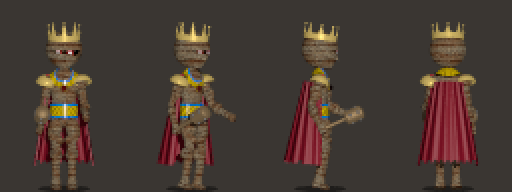

Roi momifié : muscles, grosse amulette, baudrier doré, couronne, cape cramoisie,
masse ornée. Scène `c_mummy_1.pov`, poses `inc/frames/mummy.inc` (numérotation propre).

### jack
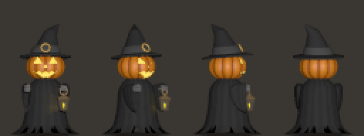

Jack-o'-lantern : citrouille sculptée et lumineuse (`inc/jack/Pumpkin.inc`), robe
noire, lanterne. Attaque à distance (tir puis récupération).
Scène `c_jack.pov`, poses `inc/frames/jack.inc`.

## Humanoïdes

### knight
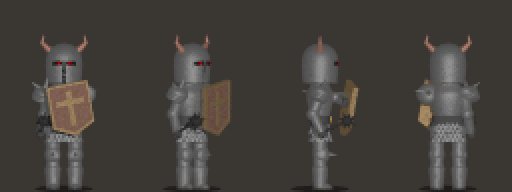

Chevalier en armure chromée, masse à pointes et bouclier à croix.
Scène `c_knight_mace.pov`, poses `inc/frames/knight.inc`.

### witch
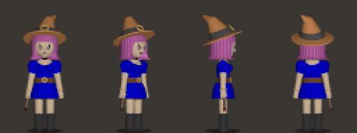

Sorcière : cheveux roux, chapeau pointu, robe bleue plissée, baguette à rubis
(tir avec flash). Scène `c_witch_blue.pov`, poses `inc/frames/witch.inc` (numérotation propre).

### wizard_blue
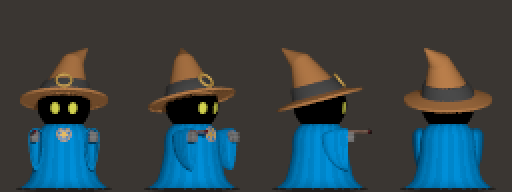

Mage en robe bleue, baguette à rubis. Modèle hors corps de base
(`inc/wizard/Wizard.inc`) : il glisse dans sa robe, sans jambes.
Scène `c_wizard_blue.pov`, poses `inc/frames/wizard.inc`.

### wizard_red
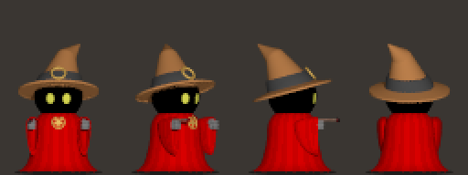

Même mage en robe rouge (`WizardRobeTint`). Scène `c_wizard_red.pov`.

## Gobelins

Petites créatures construites sur le petit dummy (corps court, grosse tête,
longs bras). Parties communes : `inc/goblin/Goblin.inc`.

### goblin
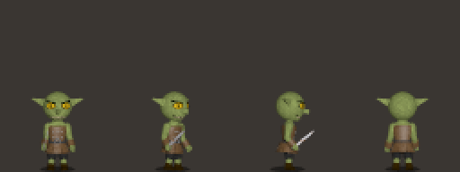

Gobelin à l'épée courte, armure de cuir. Petite foulée trottinée.
Scène `c_goblin.pov`, poses `inc/frames/small.inc`.

### goblin_warrior
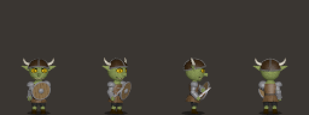

Gobelin guerrier : casque à cornes, épaulières et protections de bras en fer,
bouclier rond tenu en garde. Scène `c_goblin_warrior.pov`, poses `inc/frames/small.inc`
avec `N_Small_Shield`.

### goblin_archer
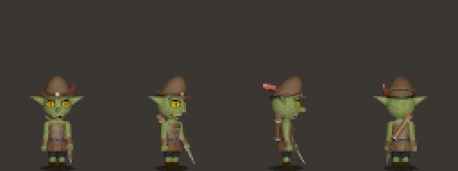

Gobelin archer : arc, carquois, chapeau de feutre à plume rouge
(`inc/armors/Hat_Feathered.inc`). Scène `c_goblin_archer.pov`, poses `inc/frames/archer.inc`.

## Monstres

### troll
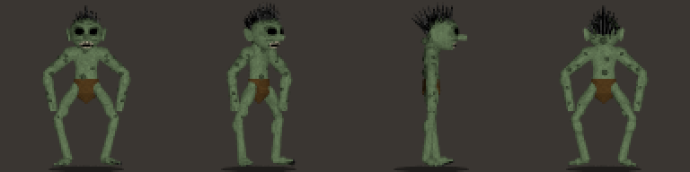

Troll musclé aux longs bras, pagne, cheveux en pétard. Cadre 96×96.
Scène `c_troll_1.pov`, poses `inc/frames/troll.inc`.

### golem
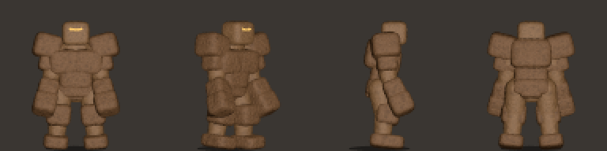

Golem d'argile : corps massif, blocs de roche sur les épaules, la poitrine et
les genoux, yeux en fentes lumineuses. Frappe au poing. Cadre 96×96.
Scène `c_golem.pov`, poses `inc/frames/golem.inc`.

### cube
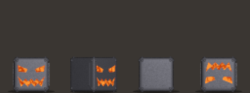

Cube maléfique de métal sombre qui avance en roulant d'une face à l'autre ;
ses visages brillent comme du métal chauffé au rouge.
Scène `c_cube.pov` (`inc/cube/Cube.inc`), poses `inc/frames/cube.inc`.

### slime
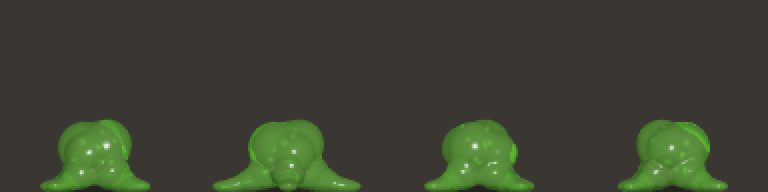

Gelée verdâtre translucide, noyau sombre et bulles, quatre pseudopodes ; crache
un jet d'acide. Cadre 96×96. Scène `c_slime.pov` (`inc/slime/Slime.inc`), poses `inc/frames/slime.inc`.

## Bases et anciennes versions (hors jeu)

Gardées pour construire de nouvelles créatures ou pour comparer.

### dummy_archer
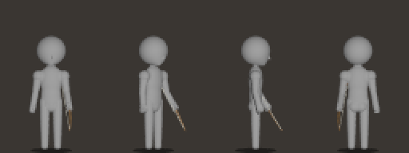

Mannequin archer : base des archers construits sur le corps de base.
Scène `c_dummy_archer.pov`, poses `inc/frames/archer.inc`.

### dummy_small
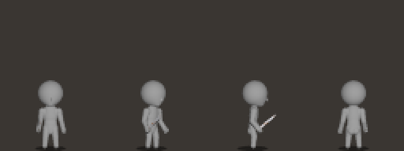

Petit mannequin : base des petites créatures (gobelins, lutins).
Scène `c_dummy_small.pov`, poses `inc/frames/small.inc`.

### skeleton_old
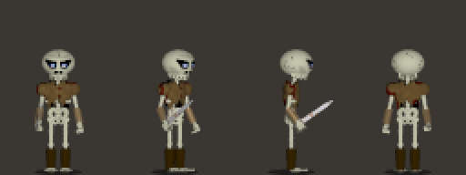

Ancien squelette (crâne ovoïde à visage peint). Scène `c_skeleton_1_old.pov`.

### jack_old
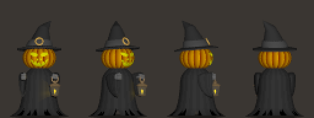

Ancien Jack (citrouille en tore à bandes). Scène `c_jack_old.pov`.
