# Objets (décors)

Décors fixes pour raycaster-386, à la même échelle que les créatures
(~0,4 m par unité POV, 6 unités pour 96 px). Chaque décor est une seule image
vue de trois quarts, légèrement de dessus, sauf mention contraire. Pour les
rendre : voir [render.md](render.md).

| Planche | Fichiers |
|---|---|
| `sprites/<nom>.json` | scène `p_*.pov`, objet réutilisable `inc/props/<Objet>.inc` |

- **Objet posé au sol** : base en `y = 0`, spec avec `"view": 3`,
  `"camera_elevation": 15`, ombre (`shadow`, opacité 0,3) et `frame.baseline`
  0,35 (0,45 pour le chaudron) pour que l'ombre ne soit pas coupée. Dans le
  moteur, l'objet est donc ~4 px trop haut : à compenser si besoin par
  l'altitude de l'entité.
- **Objet suspendu** : accroché au plafond `N_Prop_Ceiling` (`inc/props/Props.inc`),
  vu de face, sans ombre.
- **Objet lumineux** : à marquer `FX_LIGHT_SOURCE` dans le moteur pour qu'il ne
  soit pas assombri.

Les vignettes viennent de `tools/thumbnails.py` (voir [npc.md](npc.md)).

## Mobilier et stockage

### barrel
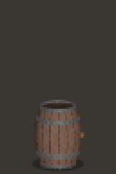

Tonneau de bois cerclé de fer. `p_barrel.pov`, `inc/props/Barrel.inc`.

### basket

Panier d'osier avec son couvercle. `p_basket.pov`, `inc/props/Basket.inc`.

### clay_pot
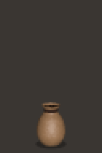

Jarre en terre cuite : panse ronde, col étroit, bord évasé.
`p_clay_pot.pov`, `inc/props/Clay_Pot.inc`.

### grain_sack
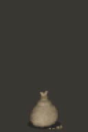

Sac de grain en toile de jute, noué d'une corde, quelques grains répandus.
`p_grain_sack.pov`, `inc/props/Grain_Sack.inc`.

### books

Trois piles de livres de tailles et de couleurs variées.
`p_books.pov`, `inc/props/Books.inc`.

## Forge et cuisine

### anvil
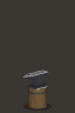

Enclume de forgeron sur une souche. `p_anvil.pov`, `inc/props/Anvil.inc`.

### cauldron
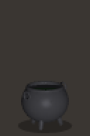

Chaudron de fonte sur trois pieds, deux anses, liquide sombre
(`N_Cauldron_Scale`, 1,5 par défaut). `p_cauldron.pov`, `inc/props/Cauldron.inc`.

### brazier
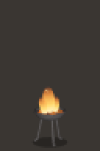

Brasero allumé : vasque de fer sur trois pieds, braises et flammes,
**animé** (4 images en boucle). Lumineux : `FX_LIGHT_SOURCE`.
`p_brazier.pov`, `inc/props/Brazier.inc`.

### brazier_out
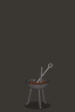

Le même brasero éteint : braises sombres, quelques tisons, deux tisonniers
(`N_Brazier_Lit = 0`). `p_brazier_out.pov`.

## Cabinet du savant

### globe
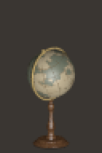

Globe ancien sur pied de noyer, méridien de laiton (64 px de haut).
`p_globe.pov`, `inc/props/Globe.inc`.

### armillary_sphere
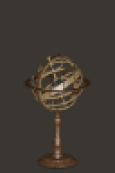

Sphère armillaire en bois, même pied et mêmes dimensions que le globe.
`p_armillary_sphere.pov`, `inc/props/Armillary_Sphere.inc`.

### telescope
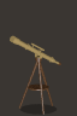

Lunette astronomique en laiton sur trépied de noyer (`N_Telescope_Scale`,
`N_Telescope_Elevation`). `p_telescope.pov`, `inc/props/Telescope.inc`.

## Objets suspendus

### chain
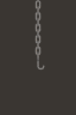

Chaîne de fer accrochée au plafond, avec un crochet. La macro
`Chain(N_Maillons, N_Echelle)` de `inc/props/Chain.inc` fait une chaîne de la
longueur voulue. `p_chain.pov`.

### lantern
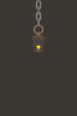

Lanterne de laiton allumée, suspendue. Lumineuse : `FX_LIGHT_SOURCE`.
`p_lantern.pov`, `inc/props/Lantern.inc`.
